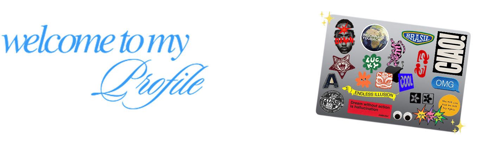

<!--

       

 &nbsp; análise e desenvolvimento de sistemas @  unisinos 
 &nbsp; porto alegre - rs 

##  &nbsp; Skills

                 

**amandamats/amandamats** is a ✨ _special_ ✨ repository because its `README.md` (this file) appears on your GitHub profile.

Here are some ideas to get you started:

 🔭 I’m currently working on ...
 🌱 I’m currently learning ...
 👯 I’m looking to collaborate on ...
 🤔 I’m looking for help with ...
 💬 Ask me about ...
 📫 How to reach me: ...
 😄 Pronouns: ...
 ⚡ Fun fact: ...
